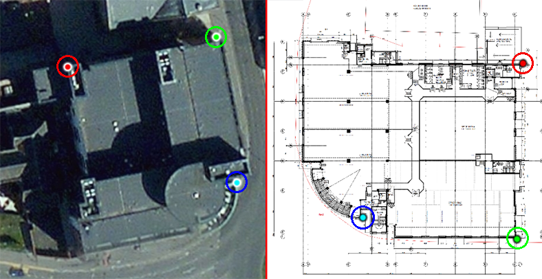

Submitting your indoor map to WRLD
===================
If you’re interested in seeing your building’s indoor space in our immersive 3D maps, read on!

This post covers creating an indoor map by georeferencing floor plan imagery and then submitting it to the WRLD indoor maps API. After we've processed your indoor map, you'll receive an email containing details of how to view it using the WRLD SDK.

By default, WRLD will not share your map data. This means that any submitted indoor maps will remain private to you unless you choose to share them.

You can follow along on Windows, Mac OS, or Linux.

| WRLD Indoor Map Format | WRLD 3D Indoor Map |
|:-----------:|:------------:|
|||

Our example building for this process is WRLD's office building, "Westport House" in Dundee. The building owners have kindly given us permission to do so. 
Please note that if you do not have the building owner’s approval to submit a map to the service, your submission may not be eligible for inclusion in the public map.

#### <a name="contents"/>Contents

The following is an outline of what this tutorial is going to cover:

1. [Installing the Required Software](#install-software)
1. [Georeferencing the Floor Plan Image](#georeference-floor-plan)
1. [Creating An Indoor Map Level](#create-indoor-map-level)
1. [Exporting Your Level In GeoJSON Format](#export-level-to-geojson)
1. [Creating the main.json File](#create-json-file)
1. [Packaging Your Map For Submission](#create-package)
1. [Submission of the Map to the WRLD Indoor Maps API](#submit-package)

---

#### <a name="install-software"/>Installing the Required Software
Pre-requisites:  

- [QGIS](https://www.qgis.org/en/site/forusers/download.html) (At the time of writing, the latest version is 2.18)
- [curl](https://curl.haxx.se/download.html) (If you're using Mac OS, or Linux, you should have this as standard).
- A floor plan image (tiff, png, or bitmap) for each of the floors you wish to submit.

**QGIS**  
(**Note**: Other GIS software packages - such as [ArcMap](http://desktop.arcgis.com/en/arcmap/) - are available)

QGIS is a free GIS package, which is why we are using it for this example. If you have access to other GIS software that supports georeferencing and polygon creation, and exports to GeoJSON, then it should also work. Of course, if you're using a different GIS software package, you'll need to adapt the instructions below as appropriate.

After installing, you'll also need to make sure that you have access to the [*Georeferencer*](http://docs.qgis.org/2.2/en/docs/user_manual/plugins/plugins_georeferencer.html) plugin, and the [*OpenLayers*](http://docs.qgis.org/2.2/en/docs/training_manual/qgis_plugins/plugin_examples.html?highlight=openlayers#basic-fa-the-openlayers-plugin) plugin. 

The Georeferencer plugin can be found under *Raster > Georeferencer*, and the OpenLayers plugin can be found under *Web > OpenLayers Plugin*.
If you find that either of these plugins are missing, you should be able to find them under *Plugins > Manage and Install Plugins* 

Georeferencer will allow you to convert your indoor floorplan to have it correctly related to a ground system of geographic co-ordinates - i.e. Making your map image spatially fit your building in terms of latlongs. This process is covered in more detail below.

OpenLayers allows you to pull map & satellite imagery into your QGIS scene. This makes creation of your initial outline much easier (if you're doing it by hand) by allowing you to line up the bounds of your feature with the OpenLayers imagery.

(**Note**: For advanced users accustomed to GIS packages, if you have access to useful data, such as a shapefile for the building, you can feel free to use these as they’ll likely be more accurate than the OpenLayers data.

---

#### <a name="georeference-floor-plan"/>Georeferencing the Floor Plan Image
If you have an image of your building’s floor plan, you can use [georeferencing](https://en.wikipedia.org/wiki/Georeference) to help you create your map. As standard, floorplan images do not contain geographic location data so, while they may be accurate and detailed, there’s nothing to associate the contents of the image with spatial locations in the world, or orient it correctly.  

[Georeferencing](https://en.wikipedia.org/wiki/Georeference) is essentially a way of saying "point **P** of my map image is at geographic coordinate **Q**"
Performing this step will allow you to view your floor plan image in QGIS with the correct location and orientation. 

- Open QGIS and add a layer of your choice via OpenLayers - we've found that QGIS best handles OpenStreetMap (OSM) and Bing Aerial
  - As an example: to add an OSM layer, choose *Web > OpenLayers plugin > OpenStreetMap > OpenStreetMap*
- Browse to your building’s location via dragging & zooming with the mouse wheel
- This should have converted your project **CRS** (**C**oordinate **R**eference **S**ystem) to *WGS84 / Pseudo Mercator ([EPSG: 3857](http://spatialreference.org/ref/sr-org/6864/))* - you can see your current CRS in the bottom right of the QGIS window
  - EPSG:3857 is also referred to as "Web Mercator" as it is the most common projection type for web maps such as Google Maps, Bing Maps, OpenStreetMap, etc
  - This is the CRS that will be used for producing this indoor map, as it shows the world in a way that avoids the stretching and skewing that is present when the map is taking latlong geographic co-ordinates into account.
  - This CRS also allows us to use the *advanced digitization tools* that will be covered in the [Creating An Indoor Map Level](#create-indoor-map-level) section below
- Open the Georeferencer (*Raster > Georeferencer > Georeferencer...*)


- Click “Add Raster”
- Select your floor plan image
- The image should be displayed in the Georeferencer window


The next step is to select a point on the floorplan image, and tell QGIS where that point is placed in the world
 
- In the Georeferencer window, ensure the “Add Point” tool is selected, and left click the first point to be referenced (a corner is usually a good choice)
- When the *Enter map coordinates* window appears, click the “From map canvas” button
- This will then let you select a corresponding point on the map in QGIS
- Left click the location on the map that matches the point you’ve just selected


- Repeat this process for a handful of points on the building perimeter
- Try to pick points that are clearly visible on the map (e.g. building corners) and, where appropriate, spread the points out as far as possible from one another



- Inaccurately placed georeference points can lead to distortion of the map, meaning that walls can be the wrong length, or at incorrect angles
- Additionally, each time a point is added, it has potential to skew the floorplan's appearance when it's overlaid on the map
- The ideal scenario is that you can use three well spread points and have the rest of the floorplan line up correctly. Only three points were used in the above example
- Open the *Transformation Settings* window, and set a file name and path for the *Output raster*
- Set the *Target SRS* to the QGIS project's CRS (should be EPSG:3857)
- Ensure that *Load in QGIS when done* is checked
- The rest of the window should look something like the following:


- Select *OK*
- Click the *Start Georeferencing* button
- After a short amount of time, the transformed image should open in the QGIS main scene view.


- Now that this image has been completed and saved out to a file, you can re-use it in another QGIS project, if needed, by just dragging the georeferenced .tiff file into QGIS
- In the QGIS *Layers* panel (found to the left of the main map window by default), locate the raster layer that has just been added. *Right click > Properties > Transparency* will allow the editing of the floorplan transparency and let you see the underlying map to make sure that the floorplan image is correctly aligned.

---

#### <a name="create-indoor-outline"/>Creating A Building Outline

Now that you have a georeferenced floorplan image, you're ready to "claim" the area of the map which contains your building. We refer to this space as the building "outline".
The outline for your building should contain any and all of your indoor map features.
For example, if a feature on floor 2 extends beyond the bounds of floor 1, you should add that outcropping to your outline.
The following image shows an example of this in practice as it displays: 

- three floors layered on top of each other (red, green, then blue)
- their "combined" guide lines (red, then cleaned up in blue)
- the building's full outline


To generate this outline, start by creating a line layer via *Layer > Create Layer > New Shapefile Layer...*. This will serve as our "scratch" layer for generating our guiding lines - think of it like a sketch before you draw the main polygons.

On the New Shapefile Layer popup window, select the *Line* radio button, ensure that your *CRS* is set to *3857* (unless you're specifically using a different CRS) then hit OK.
Set your file path and line layer name as you see fit - e.g. something like "scratch" or "guide" - and confirm.
Your new line layer should now be present in the *Layers* panel on the left of the window.
Click and drag this layer to the top of the list, to ensure that it will be visible over our other layers.
Using *Right click > Properties > Style* you can change the colour of this layer to make sure it's visible - bright red or green tend to work well.

With your scratch layer set up, you can begin to draw the guide lines for your outline's perimeter.

- Click the “Toggle Editing” button 


- Click the “Add Features” button 


- We also use the *Snapping Tool* and *Advanced Digitizing Panel* to ensure that we can make points accurate, and keep walls parallel and perpendicular to one another, where appropriate.
- Set the snapping parameters via *Settings > Snapping Options...*
- More often that not, our settings are something similar to the following: 


- These settings ensure that your can snap to any corner or edge on any active layer, including those that you're not currently working on (which will be important later).

- Ensure that Advanced Digitizing is active via *View > Toolbars > Advanced Digitizing Toolbar*
- You may notice that there's a new button available while your layer is in edit mode: the *Enable advanced digitizing tools* button.


Your first line is going to be your "base line" - i.e. the source line for keeping your walls and rooms parallel and perpendicular to one another - so having it be along one of your larger walls is usually the best approach.

As with your georeference, it's usually a good idea to start from a corner, and aim for another adjacent corner. For example, in our Westport House trace, the first line we used was the following:


Thanks to the snapping tools, you'll now be able to correctly connect your next line to your base line.
As you can see in the following image, the pink "+" denotes where your new line will connect to the current, with a slightly stronger affinity for the ends.


Ensure that the *Enable advanced digitizing tools* button is toggled on, then select the start point of your next line. If it's appropriate (and it *usually* is) you can now use the Advanced Digitizing *Perpendicular* button to create a line at a right-angle to your base line. 
After clicking the button, you simply select the line that you would like to draw perpendicular to. 
When placing the end point of your line, you'll be left with a right-angled corner!


The button just next to *Perpendicular* is *Parallel* and will, as you might expect, let you select a line with which to draw parallel to.


Using the perpendicular digitizing tool to draw our next line leaves us looking something like this:


With all of this in mind, completing most of the outline for Westport House looks something like this:


---

As you can see, there's a small section to the bottom right - the curved balcony - that we haven't covered yet.
We'll cover how to draw curves and circles now.

The way that QGIS draws a circle, or the arc of a circle, is by placing three points, and drawing the arc which would connect all three of these points. Shown in the following examples:


To create a full circle, you only need two points: your start point, and its antipodal point (i.e. the diametric opposite of the start point). From here, your "third point" is the start point again. This closes the circle.


In the case of Westport House, the floorplan contains a guide showing the centre of the circle. This can be confirmed with the digitizing tools, as we can see the length of the lines (the _d_ field) from centre to edge are equal:
 

This means that we can generate a third point, the same distance from the centre, and use that to generate an arc or a full circle.
In the case of our example, we've generated a full circle:


The initial output of this arc is very detailed - the whole circle in our example is 362 verts.


While this level of detail might be desired by some, it's overkill for most circumstances. To remedy this, we can use the *Simplify Feature* tool to reduce the vert count to something more manageable.


Simply toggle the tool on, then select the feature that you would like to simplify. The popup window will let you see the before and after of the feature's vert count, and allow you to adjust according to taste.
In this example, we're going to use a value of *0.05* - taking us from 362 verts, to 65.


---

With all of these guides in place, we're now at a point where we can generate our outline polygon for submission!


As before, create a new shapefile layer (*Layer > Create Layer > New Shapefile Layer...*) but this time make sure that the *Type* is set to the *Polygon* radio button. 
In the *New field* section of the window, enter "name" in the *Name* box, ensure that *Type* is set to *Text Data* and that *Length* is 80, and click *Add to fields list*.
Then repeat the above for a "type" text data field.

Your window should now look something like this:


Click *OK*, set your file path and line layer name as you see fit - we're using *building_outline* - and save.
You'll now have a new polygon layer in your project.
To create the actual building polygon you can essentially just "join the dots" of your guide layer.
Select the *Add Feature* tool: 


Then just start selecting the appropriate outline points from your guide layer.


When you've finished, you should have something like this:


Congratulations! You're now ready to submit your claim outline to the indoor maps service.
This will be the section of the WRLD building data that will be cleared out when you view the interior on our maps, and can serve as the basis for adding all of the interior features that you want to view.

---

In order to submit the building outline, we first need to export it as a geojson file, rather than a shapefile.
In doing this, we can also convert the format from *Pseudo-Mercator* to *Mercator* and have the points stored as latlongs - which the WRLD system will use to convert the submission into a 3D model.

#### <a name="export-level-to-geojson"/>Exporting the Level to GeoJSON

- Highlight the polygon layer that you created in the *Layers* panel
- *Right click > Save As…*
- Set *Format* to GeoJSON
- Change the *CRS* setting to WGS 84 ([EPSG: 4326](http://spatialreference.org/ref/epsg/4326/))
- Ensure that *Encoding* is set to *UTF-8*
- Set your file name and location
- Click *OK*

#### <a name="submitting-outline"/>Submitting the Outline to WRLD

To submit to our REST API via a curl command, you'll need your WRLD developer token (which you can find [here](https://accounts.wrld3d.com/users/edit))

You'll then need to fill in the following information, for everything contained within a pair of <>, as appropriate to your submission:

```sh
$ curl -v -XPOST https://indoor-maps-api.wrld3d.com/v1/edits/?token=<my developer token> -F name="<my venue name>" -F venue_street_address="<my venue address>" -F venue_phone_number="<my venue phone no.>" -F venue_email="<my venue owner email address>" -F submission_contact_email="<my email address for notifications>" -F venue_outline="@</path/to/my/file>.geojson"
```

On successful completion of this request, you should receive a reply email which contains a 40-character [UUID](https://en.wikipedia.org/wiki/Universally_unique_identifier) in the format *EIM-xxxxxxxx-xxxx-xxxx-xxxx-xxxxxxxxxxxx*. Please make note of this UUID, as you'll need it for any future updates or submissions to your indoor map.

---

The indoor maps API will now validate your outline and move your edit from the *AwaitingApproval* state to the *ApprovedForSubmission* state.  This should happen within a few minutes.  You will be e-mailed if any problems arise during this process.  Alternatively, you can also query the status of the edit with the following command (you’ll need to replace the UUID shown here with the one that was returned by your initial POST request):
```sh
$ curl -v https://indoor-maps-api.wrld3d.com/v1/edits/<my UUID>/status?token=<my developer token>
```
Once the approval process has run, you should see the following within the query response:
```json
{"status":"ApprovedForSubmission"}
```

If you have any problems, the [cheatsheet](CHEATSHEET.md) might be able to help, or feel free to [raise an issue](https://github.com/wrld3d/indoor-maps-api/issues/new) or get in touch with us at support@wrld3d.com.
