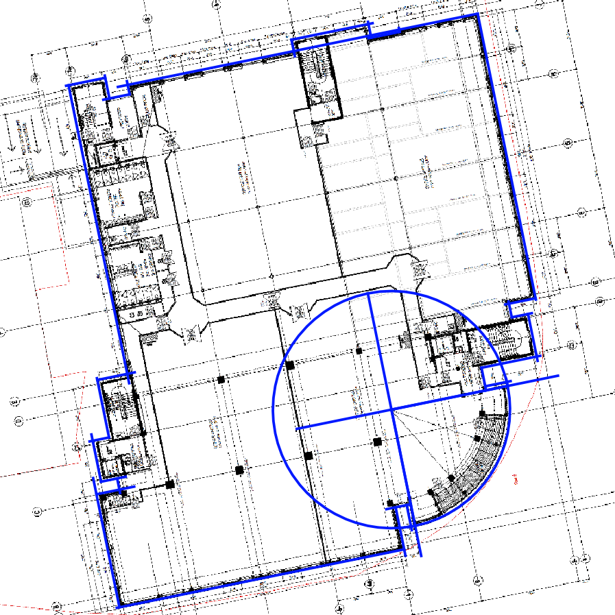

WRLD Indoor Map Outline Generation and Submission
===================
If you’re interested in seeing your building’s indoor space in our immersive 3D maps, read on!

This post covers creating an indoor map claim area by georeferencing floor plan imagery and then submitting it to the WRLD indoor maps API. After we've processed your submitted outline, you'll be able to build your full indoor map and view it using the WRLD SDK.

By default, WRLD will not share your map data. This means that any submitted indoor maps will remain private to you unless you choose to share them.

You can follow along on Windows, Mac OS, or Linux.

| WRLD Indoor Map Format | WRLD 3D Indoor Map |
|:-----------:|:------------:|
|||

The owners of the WRLD office building - Westport House in Dundee - have kindly given us permission to use the building as our example for this process.
Please note that if you do not have the building owner’s approval to submit a map to the service, your submission may not be eligible for inclusion in the public map.

#### <a name="contents"/>Contents

The following is an outline of what this tutorial is going to cover:

1. [Getting Started](#getting-started)
1. [Georeferencing the Floor Plan Image](#georeference-floor-plan)
1. [Exporting the Outline in GeoJSON Format](#export-outline-to-geojson)
1. [Submitting the Outline to the WRLD Indoor Maps API](#submit-outline)

---

#### <a name="getting-started"/>Getting Started
Pre-requisites:  

- [QGIS](https://www.qgis.org/en/site/forusers/download.html) (At the time of writing, the latest version is 2.18.xx)
- [curl](https://curl.haxx.se/download.html) (If you're using Mac OS, or Linux, you should have this as standard).
- A floor plan image (for example, a tiff, png, or bitmap) for each of the floors you wish to submit.
- A WRLD Developer Token - found on your [account page](https://accounts.wrld3d.com/users/edit) - for submission to the service.

**QGIS**  
(**Note**: Other GIS software packages - such as [ArcMap](http://desktop.arcgis.com/en/arcmap/) - are available)

QGIS is a free GIS package, which is why we are using it for this example. If you have access to other GIS software that supports georeferencing and polygon creation, and exports to GeoJSON, then it should also work. Of course, if you're using a different GIS software package, you'll need to adapt the instructions below as appropriate.

After installing, you'll also need to make sure that you have access to the [*Georeferencer*](http://docs.qgis.org/2.2/en/docs/user_manual/plugins/plugins_georeferencer.html) plugin, and the [*OpenLayers*](http://docs.qgis.org/2.2/en/docs/training_manual/qgis_plugins/plugin_examples.html?highlight=openlayers#basic-fa-the-openlayers-plugin) plugin. 

The Georeferencer plugin can be found under *Raster > Georeferencer*, and the OpenLayers plugin can be found under *Web > OpenLayers Plugin*.
If you find that either of these plugins are missing, you should be able to find them under *Plugins > Manage and Install Plugins* 

Georeferencer will allow you to convert your indoor floor plan to have it correctly related to a ground system of geographic co-ordinates - i.e. Making your floor plan image spatially correct to your building in terms of latitude and longitude. This process is covered in more detail below.

OpenLayers allows you to pull map & satellite imagery into your QGIS scene. This makes creation of your initial outline much easier (if you're doing it by hand) by allowing you to line up the bounds of your feature with the OpenLayers imagery.

(**Note**: For advanced users accustomed to GIS packages, if you have access to useful data, such as a shapefile for the building, you can feel free to use these as they’ll likely be more accurate than the OpenLayers data.)

Finally, before we get started, set your project **CRS** (**C**oordinate **R**eference **S**ystem) to *WGS84 / Pseudo Mercator ([EPSG: 3857](http://spatialreference.org/ref/sr-org/6864/))* - you can see your current CRS in the bottom right of the QGIS window.

<p align="center">

</p>

To change it, click the CRS, check the box for _Enable 'on the fly' CRS transformation (OTF)_ and enter "3857" in the _Filter_ text field.
- EPSG:3857 is also referred to as "Web Mercator" as it is the most common projection type for web maps such as Google Maps, Bing Maps, OpenStreetMap, etc
- This is the CRS that will be used for producing this indoor map, as it shows the world in a way that avoids the stretching and skewing that is present when the map is taking latlong geographic co-ordinates into account.
- This CRS also allows us to use the *advanced digitization tools* that we refer to in the [Using QGIS](https://github.com/wrld3d/wrld-indoor-maps-api/blob/docs_update/A%20-%20Using%20QGIS.md) page of this documentation

---

#### <a name="georeference-floor-plan"/>Georeferencing the Floor Plan Image
If you have an image of your building’s floor plan, you can use [georeferencing](https://en.wikipedia.org/wiki/Georeference) to help you create your map. As standard, floor plan images do not contain geographic location data so, while they may be accurate and detailed, there’s nothing to associate the contents of the image with spatial location, or orientation, in the world.   

Georeferencing is essentially a way of saying "point **P** of my map image is at geographic coordinate **(a, b)**". Performing this step will allow you to view your floor plan image in QGIS with the correct location and orientation. 

- Open QGIS and add a layer of your choice via OpenLayers - we've found that QGIS best handles OpenStreetMap (OSM) and Bing Aerial
  - As an example: to add an OSM layer, choose *Web > OpenLayers plugin > OpenStreetMap > OpenStreetMap*
- Browse to your building’s location via dragging & zooming with the mouse wheel
- Open the Georeferencer (*Raster > Georeferencer > Georeferencer...*)

<p align="center">

</p>

- Click “Add Raster”
- Select your floor plan image
- The image should be displayed in the Georeferencer window

<p align="center">

</p>

The next step is to select a point on the floor plan image, and tell QGIS where that point is placed in the world
 
- In the Georeferencer window, ensure the “Add Point” tool is selected, and left click the first point to be referenced (a corner is usually a good choice)
- When the *Enter map coordinates* window appears, click the “From map canvas” button
- This will then let you select a corresponding point on the map in QGIS
- Left click the location on the map that matches the point you’ve just selected

<p align="center">

</p>

- Repeat this process for a handful of points on the building perimeter
- Try to pick points that are clearly visible on the map (e.g. building corners) and, where appropriate, spread the points out as far as possible from one another

<p align="center">

</p>

- Inaccurately placed georeference points can lead to distortion of the map, meaning that walls can be the wrong length, or at incorrect angles
- Additionally, each time a point is added, it has potential to skew the floor plan's appearance when it's overlaid on the map
- The ideal scenario is that you can use three well spread points and have the rest of the floor plan line up correctly. Only three points were used in the above example
- Open the *Transformation Settings* window, and set a file name and path for the *Output raster*
- Set the *Target SRS* to the QGIS project's CRS (should be EPSG:3857)
- Ensure that *Load in QGIS when done* is checked
- The rest of the window should look something like the following:

<p align="center">

</p>

- Select *OK*
- Click the *Start Georeferencing* button
- After a short amount of time, the transformed image should open in the QGIS main scene view.

<p align="center">

</p>

- Now that this image has been completed and saved out to a file, you can re-use it in another QGIS project, if needed, by just dragging the georeferenced .tiff file into QGIS
- In the QGIS *Layers* panel (found to the left of the main map window by default), locate the raster layer that has just been added. *Right click > Properties > Transparency* will allow the editing of the floor plan transparency and let you see the underlying map to make sure that the floor plan image is correctly aligned.

---

#### <a name="create-indoor-outline"/>Creating A Building Outline

Now that you have a georeferenced floor plan image, you're ready to "claim" the area of the map which contains your building. We refer to this space as the building "outline".

This outline provides the area of the WRLD building data that will be cleared out when you view the 
interior on our maps, and can also serve as the basis for adding all of the interior features that you want to view.
As such, the extents of your building outline should be able to contain any and all of your indoor map features.
For example, if a feature on floor 2 extends beyond the bounds of floor 1, you should add that outcropping to your outline.
The following image shows an example of this in practice as it displays: 

- three floors layered on top of each other (red, green, then blue)
- their "combined" guide lines (red, then cleaned up in blue)
- the building's full outline

<p align="center">

</p>

If you're unsure about how to generate the polygon for your outline, or would like to see an example of the methods that we use internally, you may find [this documentation](https://github.com/wrld3d/wrld-indoor-maps-api/blob/docs_update/A%20-%20Using%20QGIS.md) helpful.

In the case of the Westport House example, our final product looks something like this:

<p align="center">

</p>

From here, you're now ready to submit your claim outline to the indoor maps service.

---

In order to submit the building outline, we first need to export it as a geojson file, rather than a shapefile.
In doing this, we can also convert the format from *Pseudo-Mercator* to *Mercator* and have the points stored as latlongs - which the WRLD system will use to convert the submission into a 3D model.

#### <a name="export-outline-to-geojson"/>Exporting the Outline in GeoJSON Format

- Highlight the polygon layer that you created in the *Layers* panel
- *Right click > Save As…*
- Set *Format* to GeoJSON
- Change the *CRS* setting to WGS 84 ([EPSG: 4326](http://spatialreference.org/ref/epsg/4326/))
- Ensure that *Encoding* is set to *UTF-8*
- Set your file name and location
- Click *OK*

#### <a name="submit-outline"/>Submitting the Outline to the WRLD Indoor Maps API

To submit to our REST API via a curl command, you'll need your WRLD developer token (which you can find [here](https://accounts.wrld3d.com/users/edit))

You'll then need to fill in the following information, replacing everything marked by a pair of chevrons (<>) including the chevrons themselves, as appropriate to your submission (i.e. "&lt;my venue phone no.&gt;" would be replaced by "+441382555555"):

```sh
$ curl -v -XPOST https://indoor-maps-api.wrld3d.com/v1/edits/?token=<my developer token> -F name="<my venue name>" -F venue_street_address="<my venue address>" -F venue_phone_number="<my venue phone no.>" -F venue_email="<my venue owner email address>" -F submission_contact_email="<my email address for notifications>" -F venue_outline="@</path/to/my/file>.geojson"
```

On successful completion of this request, you should receive a reply email which contains a 40-character [UUID](https://en.wikipedia.org/wiki/Universally_unique_identifier) in the format *EIM-xxxxxxxx-xxxx-xxxx-xxxx-xxxxxxxxxxxx*. Please make note of this UUID, as you'll need it for any future submissions or updates to your indoor map.

---

The indoor maps API will now validate your outline and move your edit from the *AwaitingApproval* state to the *ApprovedForSubmission* state.  This should happen within a few minutes.  You will be e-mailed if any problems arise during this process.  Alternatively, you can also query the status of the edit with the following command (you’ll need to replace the UUID shown here with the one that was returned by your initial POST request):

```sh
$ curl -v https://indoor-maps-api.wrld3d.com/v1/edits/<my UUID>/status?token=<my developer token>
```
Once the approval process has run, you should see the following within the query response:
```json
{"status":"ApprovedForSubmission"}
```

If you have any problems, the [cheatsheet](CHEATSHEET.md) might be able to help, or feel free to [raise an issue](https://github.com/wrld3d/indoor-maps-api/issues/new) or get in touch with us at support@wrld3d.com.
