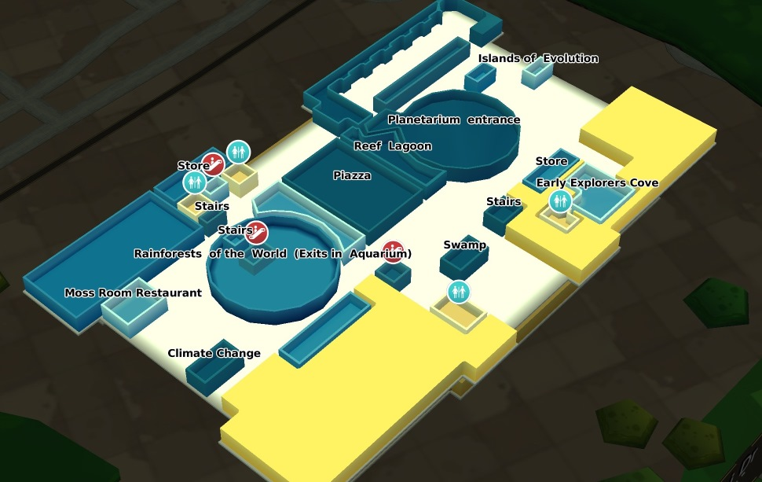

eeGeo Indoor Map Format v0.0.1
===================

This document describes version 0.0.1 of the eeGeo data format for indoor maps.

---

#### Archive structure

Indoor maps are submitted to the REST API as a specially structured .ZIP archive.  This should contain a file named `main.json`. The main JSON file describes the building and references each of the building’s levels.  Each level’s geometry is then described in a separate GeoJSON file.

```
westport-house.zip/
├── main.json
├── westport-house-floor-gf.geojson
├── westport-house-floor-1.geojson
├── westport-house-floor-2.geojson
├── westport-house-floor-3.geojson
├── westport-house-floor-4.geojson
├── westport-house-floor-5.geojson
└── westport-house-floor-6.geojson
```

An example of this file structure can be found in the [examples directory.](/examples/)

##### Main JSON file

The main JSON file is named `main.json` sits in the root of the submitted archive, with the GeoJSON files for each level alongside it.  It contains JSON for a Building object, made up of several levels, described below.

###### Building
|Field|Type|Required|Description|
 --- | --- | --- | ---
|`id`|string|Yes| an identifier for the building
|`name`|string|Yes| the building's name
|`owner`|string|Yes| the owner of the building
|`location`|GeoJSON point|Yes| a coordinate roughly in the center of the building
|`levels`|Level[]|Yes| an array of the levels that make up the building (explained below)
|`source-vendor`|string|No, default:"eegeo"| a string identifying the vendor of the building map
 
###### Level
|Field|Type|Description|
 --- | --- | ---
|`id`|string| an identifier for the level
|`name`|string| the abbreviated version of the level’s name (e.g. ‘G’, ‘1’, etc.)
|`readable_name`|string| the level’s full name, e.g. “Ground Floor”, “First Floor”, etc.
|`z_order`|integer| should be 0 for the lowest level and increment by one for each level above that
|`filename`|string| filename of the GeoJSON file containing the features of the level. Must not begin with a period or underscore

###### Example

```json
{
	"id": "westport_house",
	"name": "Westport House",
	"owner": "eeGeo",
	"location": {
		"type": "Point",
		"coordinates": [56.459920, -2.977999]
	},
	"levels": [{
		"id": "westport-house-floor-gf",
		"name": "G",
		"readable_name": "Ground Floor",
		"z_order": 0,
       "filename": "westport-house-floor-gf.geojson"
	},
	{
		"id": "westport-house-floor-1",
		"name": "1",
		"readable_name": "First Floor",
		"z_order": 1,
       "filename": "westport-house-floor-1.geojson"	
	},
    ...
	]
}  
```

##### Level GeoJSONs

The features in each level are specified in the [GeoJSON format](http://geojson.org/geojson-spec.html), exportable from several common GIS tools (QGIS, ArcGIS, etc.).

Each level’s GeoJSON file is expected to contain a FeatureCollection in the WGS84 (EPSG: 4326) Coordinate Reference System.

In addition to the default GeoJSON members, each feature may specify some additional attributes.

###### Attributes

|Attribute|Type|Description|
 --- | --- | ---
|`id`|string|an identifier for the feature
|`name`|string|the feature's name. Will be displayed as a label over certain "Feature Types". Optional, can be null.
|`type`|string|the type of the feature - this should match one of the strings in, “Feature Types,” below.
 
###### Feature Types
|Type|Shows Label|Description|
 --- | --- | --- 
|`building_outline`|Yes| denotes the area covered by the exterior of the building
|`wall`|Yes| interior walls
|`window`|Yes| windows
|`door`|Yes| doors
|`inaccessible space`|No| any space inside the building which is not mapped or accessible
|`floor opening`|No| openings in the floor which should be cut away from the area described by the building_outline
|`unit`|Yes| specifies areas around which interior walls should be created (e.g. units in a shopping centre)
|`room`|Yes| marks out interior rooms e.g. meeting rooms in an office
|`hallway`|Yes| specifies hall areas or corridors
|`stairs`|Yes| stairs between levels
|`escalator`|Yes| escalators
|`elevator`|Yes| specifies the area taken up by elevator shafts
|`bathroom`|Yes| marks out bathrooms in the current level
|`no_geometry`|Yes| a feature for which no 3d geometry should be generated

All feature types listed are expected to be specified as GeoJSON Polygons. 

##### Label Icons

If a feature is given a label which matches one of the following strings, the text will be replaced with a POI icon. This setting is controlled by the app, and can be modified by [InteriorsEntitiesPinsController.cpp.](https://github.com/eegeo/eegeo-example-app/blob/master/src/InteriorsEntitiesPins/SdkModel/InteriorsEntitiesPinsController.cpp)

|Label|
----
|`Restroom`|
|`Men's Bathroom`|
|`Women's Bathroom`|
|`Bathroom`|
|`Elevator`|
|`Escalator`|
|`Stairs`|


###### Example

```json
{
    "type": "FeatureCollection",
    "features": [ { 
        "type": "Feature", 
        "properties": { 
        	"id": 1,
            "type" : "building_outline",
            "name" : "westport house"
            }, 
        "geometry": { 
            "type": "Polygon",     
            "coordinates": [ [ [ -2.977893780725116, 56.459973605758755 ], [ -2.977893780725116, 56.459923432195168 ], [ -2.977952157716961, 56.459887593898202 ], [ -2.978017021041228, 56.459869674730484 ], [ -2.978081884365498, 56.459858923222477 ], [ -2.97807539803307, 56.459826668682346 ], [ -2.978594304627225, 56.459780078755287 ], [ -2.978620249956932, 56.459901929213025 ], [ -2.978587818294797, 56.459901929213025 ], [ -2.978607277292078, 56.459962854295306 ], [ -2.978574845629944, 56.459970021945622 ], [ -2.978659167951494, 56.460167131799167 ], [ -2.978801867264886, 56.460152796571585 ], [ -2.978827812594594, 56.46024597545415 ], [ -2.978600790959652, 56.460263894443827 ], [ -2.978587818294797, 56.460249559252766 ], [ -2.977965130381813, 56.460324818945473 ], [ -2.977828917400847, 56.459984357270066 ], [ -2.977893780725116, 56.459973605758755 ] ] ] 
            } 
        } ]
}
```

---

#### Disclaimer
This is an early version of the data format and API for eeGeo indoor maps.  eeGeo Ltd reserves the right to make changes to the API and its documentation at any time.  

---

#### Contact us
If you have any problems or queries please [raise an issue](https://github.com/eegeo/indoor-maps-api/issues/new) or alternatively get in touch with us at support@eegeo.com.

